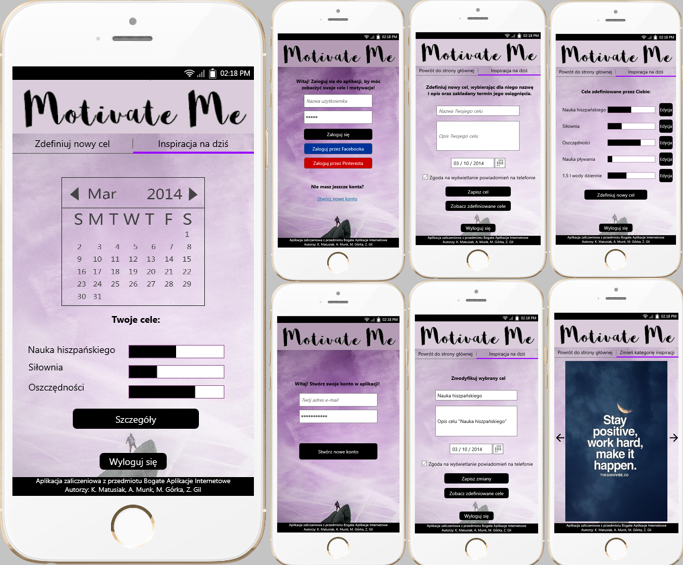

## BAI - Motivate Me

### Temat: 
Aplikacja motywująca do realizacji celów

### Opis: 
Użytkownik po zalogowaniu ma możliwość zdefiniowania celów i terminów realizacji oraz monitorowania postępu. Dodatkową funkcjonalnością jest wyświetlanie inspiracji w wybranej kategorii z serwisu Pinterest oraz codziennych powiadomień, motywujących do realizacji celów.

### Skład grupy:

- Magdalena Górka
- Zuzanna Gil
- Anna Munk
- Katarzyna Matusiak

### System zarządzania projektem:
https://trello.com/b/tjuWn60W/projekt-bai

### Czas pracy:
https://www.dropbox.com/s/cukv7f1nydka7ci/Czas%20pracy.xlsx?dl=0

### Prototyp:

https://github.com/matusiakk/BAI-Motivator/blob/master/BAI%20projekt%20-%20prototyp.mp

